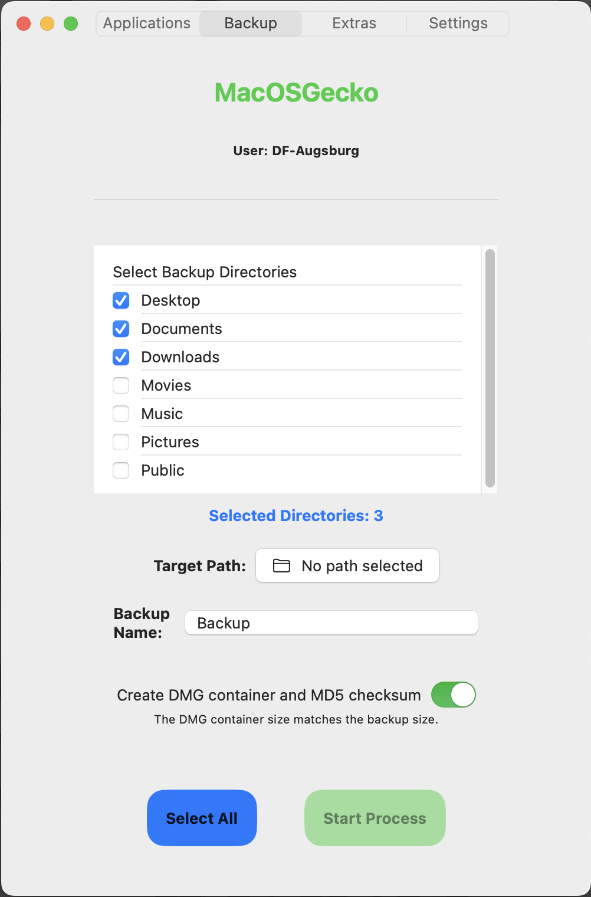
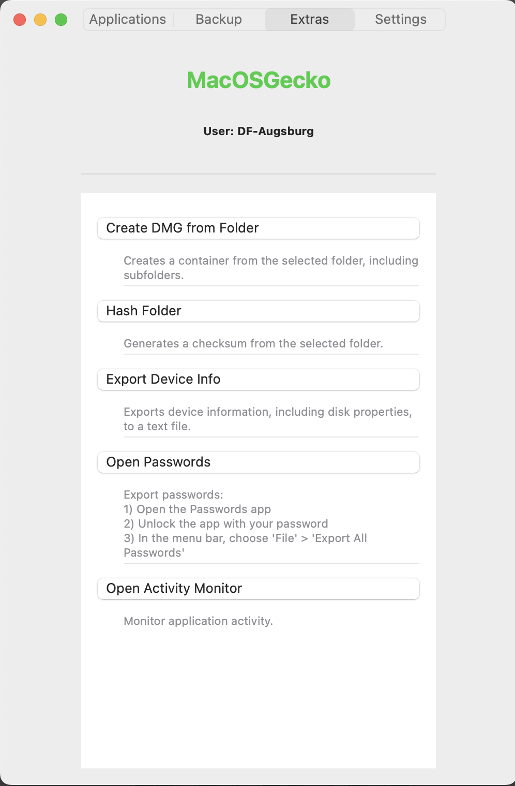
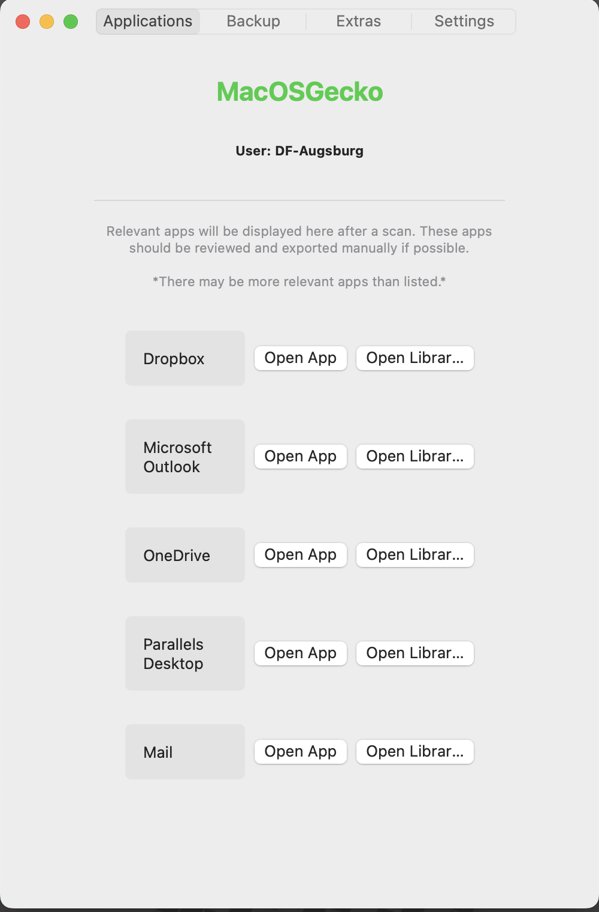
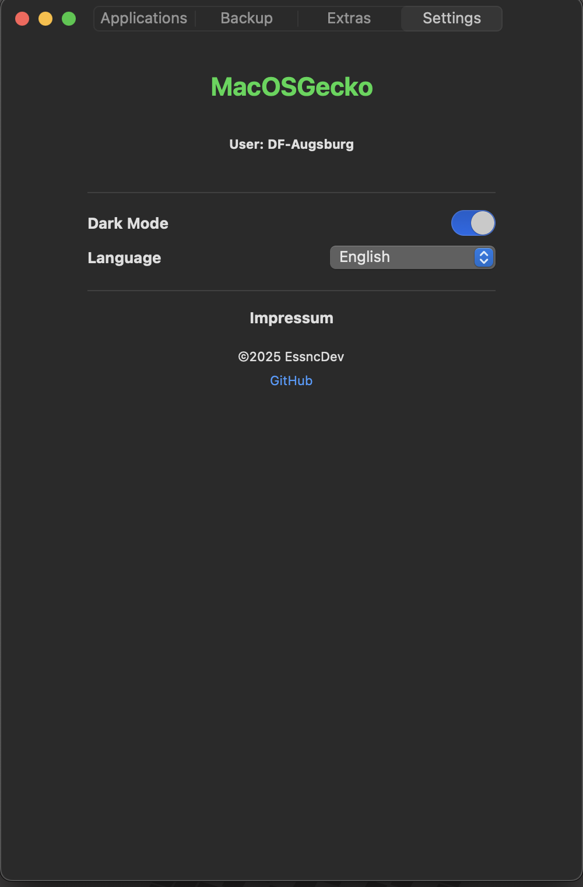

# MacOS-Gecko

**MacOS-Gecko** is a versatile program designed to standardize the process of copying important MacOS directories, including Desktop, Photos, Videos, and Downloads. The application is primarily built for data backup and archival purposes but can be utilized in various use cases that require the secure transfer and storage of MacOS data.

The program also generates a MD5 hash and a DMG container of the copied data for integrity checks. It collects device-specific information such as memory, serial number, and installed programs, and logs detailed reports (including errors and results) for every operation.

Best of all, **MacOS-Gecko** can run without requiring admin rights and can be executed directly from external drives.

## Features

* **Standardized Data Copying**: Copy essential MacOS directories (e.g., Desktop, Photos, Videos, Downloads) to another location or external drive.
* **Data Integrity**: Generates an MD5 hash and creates a DMG container of the copied data to verify the integrity of the backup.
* **Device Information Collection**: Retrieves information about the system such as RAM size, serial number, and installed programs.
* **Logging**: Tracks operation results and errors, with logs for troubleshooting.
* **No Admin Rights Required**: Runs without requiring elevated system privileges.
* **Portable**: Can be executed from external drives, making it easy to use across multiple machines.

## Installation

### Requirements:

* MacOS Version 11.5 or higher to run the deployment App
* 
* No admin rights required for installation or operation.

### Steps:

1. Download the latest release from "releases" branch in necessary version.
2. Extract the files (if needed).
3. Run the `MacOS-Gecko` executable directly from the folder or external drive.

## Usage

### 1. Copying Data:

Run the program from any location, and it will automatically identify standard MacOS directories such as:

* Desktop
* Photos
* Videos
* Downloads
* Documents
* Public

It will then copy these directories to a user-defined location or external drive.

### 2. Data Integrity:

Once the copying process is complete, an MD5 hash can be generated for the data. This allows for verification that the copied files are identical to the originals.

Additionally, a DMG file (Disk Image) of the copied data can be created for easy storage or sharing.

### 3. Device Information:

The program will automatically gather information about the system, including:

* RAM size
* Serial number
* Installed programs
* Operating system version

### 4. Logs:

All actions, including errors and results, will be logged into a text file. This log can be helpful for troubleshooting and keeping a record of your backups.

## Command Line Options

* None; pure UI-based; might be added later

## Troubleshooting

* **Permissions Issues**: Since the program does not require admin rights, it should run without needing elevated privileges. Ensure that you have read and write permissions to the directories you're working with.

* **Data Integrity**: If you notice any discrepancies after copying the data, verify the MD5 hash and check the log file for any potential errors during the backup process.

## Contributing

Feel free to fork the repository, make changes, and submit pull requests! If you have any feature requests or bug reports, open an issue on the [Issues page](https://github.com/EssncDev/MacOS-Gecko/issues).

